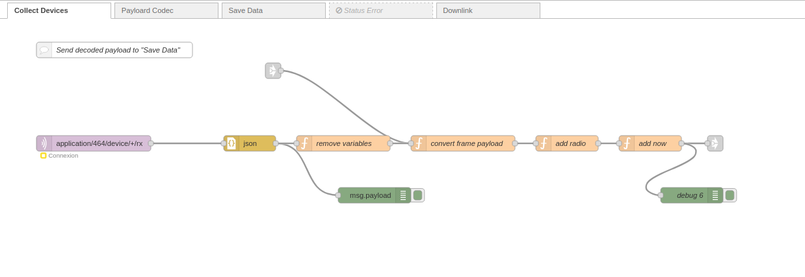

# Introduction
Ce mini-projet a pour objectif de parcourir les différentes étapes du processus IoT, allant de l’acquisition des données des capteurs à leur transmission et analyse dans le cloud. À partir des travaux pratiques déjà réalisés, nous allons améliorer les codes existants en utilisant SAUL pour la collecte des mesures des capteurs. Nous utiliserons un capteur intégré ST LPS22HB pour mesurer la température et la pression atmosphérique, ainsi qu’un module de position Grove SIM28 pour obtenir la longitude, la latitude et l’altitude.

Les données générées par les capteurs seront envoyées via le module LoRa de la carte vers le serveur Campus IoT sous forme de payload. Ces données seront ensuite récupérées à l’aide de NodeRed par MQTT, et décodées, puis stockées dans un jeu de données avec InfluDB. Enfin, nous utiliserons Grafana pour la visualisation des informations collectées.

# Domaine(s) d’utilisation
Ce projet joue un rôle clé dans la **recherche atmosphérique et environnementale**. Par exemple, grâce à des équipements embarqués sur des ballons atmosphériques, il est possible de mesurer en temps réel des paramètres tels que la température et la pression atmosphérique. Ces données sont essentielles pour étudier la structure de l’atmosphère, les conditions météorologiques et les changements climatiques. Elles peuvent également être utilisées pour valider des modèles climatiques et améliorer la précision des prévisions météorologiques. En outre, le système peut être associé à des capteurs de polluants pour surveiller la qualité de l’air et identifier la distribution des polluants à différentes altitudes, contribuant ainsi à l’élaboration de politiques de protection de l’environnement.

Dans le domaine de la **surveillance des catastrophes**, ce projet offre également un fort potentiel. En collectant et en analysant en temps réel les variations des conditions atmosphériques, il est possible de détecter les signes précurseurs de phénomènes météorologiques extrêmes tels que les cyclones et les pluies torrentielles. Ce système pourrait être utilisé comme station météorologique portable dans des zones montagneuses ou isolées, comblant ainsi les lacunes des stations traditionnelles et améliorant la couverture et la réactivité des systèmes de surveillance.

# Concurrence marché
Le marché des projets IoT pour la surveillance environnementale et la collecte de données atmosphériques est compétitif, avec plusieurs acteurs qui proposent des solutions similaires. Voici quelques exemples de concurrents potentiels dans ce domaine :

## 1. Entreprises spécialisées dans les ballons-sondes et la météorologie
Des entreprises comme World View et Sentinel Labs utilisent des ballons-sondes pour collecter des données environnementales à haute altitude, principalement dans les domaines de la recherche scientifique, de la météorologie et de l’observation du climat.
Aerospace Corporation et NASA utilisent également des technologies similaires pour des missions de recherche spatiale et atmosphérique, y compris la collecte de données GNSS et météorologiques.
## 2. Fournisseurs de capteurs IoT pour la surveillance environnementale
Des entreprises comme qui SENSIT propose des solutions IoT pour la collecte de données environnementales telles que la température, l'humidité, la pression et la qualité de l'air. Ces entreprises offrent des capteurs connectés qui peuvent être intégrés dans des systèmes plus larges pour surveiller les conditions environnementales en temps réel.
Et Bosch sont également des acteurs majeurs dans le domaine des capteurs IoT, avec une gamme d’appareils utilisés pour surveiller les conditions environnementales, y compris dans des applications liées à la météorologie.

# Equipements
Pour les équiepement du projet, nous allons utilié une carte STM32 F446RE, la carte LoRaWAN Sensor Unit Kit (STM32L151) avec un capteur de temperature et de pression integré (ST LPS22HB), et le module GPS UART Grove SIM28.

## 1.STM32 Nucleo F446RE
Le STM32 Nucleo F446RE est une carte de développement basée sur le STM32F446R, fournie par STMicroelectronics, spécialement conçue pour le développement de systèmes embarqués. Elle est équipée d'un processeur ARM Cortex-M4, offrant des performances efficaces et de nombreuses interfaces périphériques, permettant de se connecter facilement à divers capteurs et modules réseau. Elle est largement utilisée dans des projets IoT tels que la maison intelligente, la surveillance environnementale, etc. Son faible coût et sa facilité d'utilisation en font un choix idéal pour les étudiants et les ingénieurs souhaitant apprendre les systèmes embarqués et développer des prototypes rapidement.

## 2.Module LoRa Wyres Base
La carte Wyres Base est une carte électronique disposant d'un microcontroleur basse consommation d'énergie ST Microelectronic STM32L151CC, un composant de communication LoRa Semtech SX1272 et de plusieurs capteurs I2C comme l’altimètre et température que nous utilise dans notre projet. cette carte dispose également de plusieurs porte de communication. dans cette projet, nous utilison UART pour récupérer la donnees de la location

## 3.Module GPS UART Grove SIM28
Ce module est un gadget économique et programmable sur le terrain équipé d'un SIM28 et configuré pour la communication série. Il dispose de 22 canaux de suivi / 66 canaux d'acquisition pour la réception GPS. La sensibilité de suivi et d'acquisition atteint jusqu'à -160dBm, ce qui en fait un excellent choix pour les projets de navigation personnelle et les services de localisation, ainsi qu'un produit remarquable parmi ceux de la même gamme de prix.

# Bilan énergétique
Le système étudié transmet des données toutes les 2 minutes. Son bilan énergétique repose sur trois principaux composants : le module LoRaWAN, le microcontrôleur STM32 et le module GPS. Voici une analyse détaillée des sources de consommation énergétique de ces éléments :

## 1. Module LoRaWAN
Le module LoRaWAN est responsable de la communication sans fil, utilisant la bande de fréquence de 868 MHz. Son fonctionnement est caractérisé par deux modes :  
- **Mode actif** : pendant 1 seconde par cycle de 2 minutes, le module consomme **214 μA/MHz**, soit une consommation énergétique totale de **214 μAs** avec un frequence de communication LoraWan de 868 MHz.  
- **Mode veille** : durant les 119 secondes restantes, la consommation chute à **0.9 μA**, correspondant à **107.1 μAs**.  

Consommation totale pour le module LoRaWAN : **321.1 μAs** par cycle de 2 minutes.  

## 2. Microcontrôleur STM32
Le microcontrôleur STM32, responsable de la gestion des opérations et de la coordination des modules, fonctionne de manière continue pendant le cycle de 2 minutes. Sa consommation est stable à **60 μA**, ce qui correspond à une consommation énergétique totale de **7200 μAs**.  

## 3. Module GPS
Le module GPS, utilisé pour obtenir les coordonnées de localisation, est actif pendant 30 secondes par cycle. Il consomme **40 mA**, soit une énergie totale de **1200 mAs**.  

## 4. Consommation Totale du Système
En additionnant les contributions des trois modules, la consommation énergétique totale du système par cycle de 2 minutes s'élève à **1.208 As**. Avec une alimentation de **3.3V**, cela correspond à une puissance moyenne de **33.22 mW**.  

## 5. Répartition de la Consommation Énergétique
L'analyse des contributions montre que le module GPS domine largement la consommation énergétique du système, représentant plus de **99%** de l'énergie totale consommée. Les autres composants, bien que nécessaires, contribuent de manière négligeable :  
- **Module GPS** : 99.34%  
- **Microcontrôleur STM32** : 0.60%  
- **Module LoRaWAN** : 0.03%  

# Format de données (payload)
fPort : 2 to 170

uint8 : txpower (2,5,8,11,14) in dBm

uint8 : datarate (0,1,2,3,4,5)

int16 : temperature in 0.01 °C

int24 : latitude

int24 : longitude

int16 : altitude

# Métriques logicielles
Nombre total de lignes de code / Nombre de lignes de code ajoutées-modifiées
Taille du firmware (.bin)

# Travail Réalisé

## Problemes
