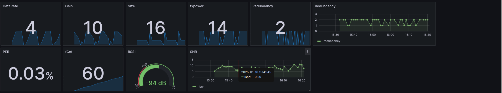

# Introduction
Ce mini-projet a pour objectif de parcourir les différentes étapes du processus IoT, allant de l’acquisition des données des capteurs à leur transmission et analyse dans le cloud. De plus, pour ce mini-projet, le développement No code sera la méthode utilise, cette méthode est une approche du développement de logiciels permettant de créer et de déployer des logiciels sans écrire de code informatique, grâce à l'utilisation de plateformes de développement No Code que l'on va expliquer plus tard.

À partir des travaux pratiques déjà réalisés, nous allons améliorer les codes existants en utilisant SAUL ([S]ensor [A]ctuator [U]ber [L]ayer) pour la collecte des mesures des capteurs. Nous utiliserons un capteur intégré ST LPS22HB (qui est intégré dans la carte LoRa) pour mesurer la température et la pression atmosphérique, ainsi qu’un module de position Grove SIM28 pour obtenir la longitude, la latitude et l’altitude.

Les données générées par les capteurs seront envoyées via le module LoRa de la carte vers le serveur Campus IoT (Chirpstack) sous forme de payload. Ces données seront ensuite récupérées à l’aide de NodeRed par MQTT, et décodées, puis stockées dans un jeu de données avec InfluDB. Enfin, nous utiliserons Grafana pour la visualisation des informations collectées. Voir schéma figure 1 ci-dessous.


<p align="center"><em>Figure 1: Schéma explicatif</em></p>

# Domaines d’utilisation
Ce mini-projet peut jouer un rôle clé dans la **recherche atmosphérique et environnementale**. Par exemple, grâce à des équipements embarqués sur des ballons atmosphériques, il est possible de mesurer en temps réel des paramètres tels que la température et la pression atmosphérique. Ces données sont essentielles pour étudier la structure de l’atmosphère, les conditions météorologiques et les changements climatiques. Elles peuvent également être utilisées pour valider des modèles climatiques et améliorer la précision des prévisions météorologiques. Enfin, le système peut être associé à des capteurs de polluants pour surveiller la qualité de l’air et identifier la distribution des polluants à différentes altitudes, contribuant ainsi à l’élaboration de politiques de protection de l’environnement.

Dans le domaine de la **surveillance des catastrophes**, ce mini-projet peut aussi avoir un fort potentiel. En collectant et en analysant en temps réel les variations des conditions atmosphériques, il est possible de détecter les signes précurseurs de phénomènes météorologiques extrêmes tels que les cyclones et les pluies torrentielles. Ce système pourrait être utilisé comme station météorologique portable dans des zones montagneuses ou isolées, comblant ainsi les lacunes des stations traditionnelles et améliorant la couverture et la réactivité des systèmes de surveillance.

# Concurrence marché
Le marché des solutions IoT dédiées à la collecte, la transmission et l’analyse des données environnementales est en pleine croissance, avec de nombreux acteurs proposant des technologies similaires à celles utilisées dans ce projet.

## Acteurs majeurs  
1. **Bosch**  
   Propose une large gamme de capteurs IoT pour mesurer la pression atmosphérique et la température. Ces capteurs se distinguent par leur précision et leur compatibilité avec divers protocoles IoT, ce qui en fait une référence dans le domaine.  

2. **SENSIT**  
   Fournit des solutions intégrées avec des capteurs connectés pour mesurer et analyser en temps réel des paramètres environnementaux tels que la température et l’humidité, souvent utilisées dans des systèmes de grande échelle.  

3. **Semtech**  
   Développe des modules LoRa et des solutions réseaux complèt pour la transmission longue distance des données des capteurs, particulièrement adaptés aux environnements IoT nécessitant une faible consommation énergétique.  

## Contenu du projet
Ce mini-projet se distingue par l’utilisation de technologies accessibles, comme le capteur ST LPS22HB et le module de position Grove SIM28, offrant une solution économique et efficace pour mesurer plusieurs paramètres (température, pression et position géographique). En couvrant l’ensemble du processus IoT, de l’acquisition des données à leur visualisation via des outils tels que Grafana, il propose une chaîne IoT complète qui dépasse les produits se limitant à la collecte ou à la transmission des données. De plus, l’adoption de standards ouverts, notamment les protocoles MQTT et les outils comme NodeRED, garantit une grande flexibilité et une interopérabilité avec d’autres systèmes, renforçant ainsi son potentiel d’intégration et d’adaptabilité.

## Potentiel du projet face à la concurrence  
Ce mini-projet se positionne comme une solution pédagogique et modulaire, offrant une base idéale pour des applications IoT personnalisées et évolutives. Il se distingue par son orientation vers l’intégration de bout en bout avec le No code, sa simplicité de mise en œuvre et son coût réduit (2 carte et 1 capteur), le rendant accessible à des contextes éducatifs ou à des petites entreprises cherchant à tester ou déployer des systèmes IoT à faible échelle.

# Equipements
Pour les équiepement du projet, nous allons utilié une carte STM32 F446RE, la carte LoRaWAN Sensor Unit Kit (STM32L151) avec un capteur de temperature et de pression integré (ST LPS22HB) et le module GPS UART Grove SIM28 (Figure 2).


<p align="center"><em>Figure 2: Cartes</em></p>

## 1.STM32 Nucleo F446RE
Le STM32 Nucleo F446RE (au centre de l'image) est une carte de développement fournie par STMicroelectronics, spécialement conçue pour le développement de systèmes embarqués. Elle est équipée d'un processeur ARM Cortex-M4, offrant des performances efficaces et de nombreuses interfaces périphériques, permettant de se connecter facilement à divers capteurs et modules réseau. Elle est largement utilisée dans des projets IoT et embarqués. Son faible coût et sa facilité d'utilisation en font un choix idéal pour les étudiants qui veullent travailler dans un projet embarqué.

## 2.Module LoRa Wyres Base
La carte Wyres Base (dans le coin supérieur droit de l'image) est une carte électronique disposant d'un microcontroleur basse consommation d'énergie ST Microelectronic STM32L151CC, un composant de communication LoRa Semtech SX1272 et de plusieurs capteurs I2C comme l’altimètre et température que nous utilise dans notre projet. Cette carte dispose également de plusieurs port de communication. dans cette projet, nous utilison UART pour récupérer les données de la localisation

## 3.Module GPS UART Grove SIM28
Ce module (dans le coin inférieur droit de l'image) est un gadget économique et programmable sur le terrain équipé d'un SIM28 et configuré pour la communication série. Il dispose de 22 canaux de suivi / 66 canaux d'acquisition pour la réception GPS. La sensibilité de suivi et d'acquisition atteint jusqu'à -160dBm, ce qui en fait un excellent choix pour les projets de navigation personnelle et les services de localisation, ainsi qu'un produit remarquable parmi ceux de la même gamme de prix.

# Bilan énergétique
Le système étudié transmet des données toutes les 2 minutes. Le bilan énergétique repose sur trois principaux composants : le module LoRaWAN, le microcontrôleur STM32 et le module GPS. Voici une analyse détaillée des sources de consommation énergétique de ces éléments :

## 1. Module LoRaWAN
Le module LoRaWAN est responsable de la communication sans fil, utilisant la bande de fréquence de 868 MHz. Son fonctionnement est caractérisé par deux modes :  
- **Mode actif** : pendant 1 seconde par cycle de 2 minutes, le module consomme **214 μA/MHz**, soit une consommation énergétique totale de **214 μAs** avec un frequence de communication LoraWan de 868 MHz.  
- **Mode veille** : durant les 119 secondes restantes, la consommation chute à **0.9 μA**, correspondant à **107.1 μAs**.  

Consommation totale pour le module LoRaWAN : **321.1 μAs** par cycle de 2 minutes.  

## 2. Microcontrôleur STM32
Le microcontrôleur STM32, responsable de la gestion des opérations et de la coordination des modules, fonctionne de manière continue pendant le cycle de 2 minutes. Sa consommation est stable à **60 μA**, ce qui correspond à une consommation énergétique totale de **7200 μAs**.  

## 3. Module GPS
Le module GPS, utilisé pour obtenir les coordonnées de localisation, est actif pendant 30 secondes par cycle. Il consomme **40 mA**, soit une énergie totale de **1200 mAs**.  

## 4. Consommation Totale du Système
En additionnant les contributions des trois modules, la consommation énergétique totale du système par cycle de 2 minutes s'élève à **1.208 As**. Avec une alimentation de **3.3V**, cela correspond à une puissance moyenne de **33.22 mW**.  

## 5. Répartition de la Consommation Énergétique
L'analyse des contributions montre que le module GPS domine largement la consommation énergétique du système, représentant plus de **99%** de l'énergie totale consommée. Les autres composants, bien que nécessaires, contribuent de manière négligeable :  
- **Module GPS** : 99.34%  
- **Microcontrôleur STM32** : 0.60%  
- **Module LoRaWAN** : 0.03%  

# Format de données (payload)

Un format de données (payload) décrit une structure d'information utilisée pour transmettre des données dans un système de communication.

fPort : 2 to 170 
int16 : altitude
float64 : latitude
float64 : longitude
int16 : temperature
int16 : pressure
uint8 : datarate (0,1,2,3,4,5)
float64 : gain
int16 : size
uint8 : txpower en dBm

Voici l'explication détaillée des différents éléments dans le payload :

- fPort est un champ qui représente le numéro de port de la charge utile (payload).
- altitude, latitude et longitude sont les coordonnées GPS mesurées en degré et en métres.
- temperature et pressure sont les données du capteur.
- datarate représente le taux de transmission des données. Les valeurs spécifiées (0,1,2,3,4,5) indiquent des niveaux spécifiques de la vitesse de transmission.
- gain représente le facteur d'amplification du signal.
- size représente la taille en octet de l'objet du payload.
- txpower représente la puissance de transmission du signal.
  
# Métriques logicielles

- Comme dit précédemment, nous avons repris le projet FTD de l'exemple riot-os. Nous avons ajouté des lignes pour SAUL et LPP Cayenne. 
Nombre de lignes de code ajoutées-modifiées : 60 lignes environ. La partie SAUL est utilisée pour la collecte de données et LPP pour la communication.

Voici le code ajouté dans le main.c :
```c
#include <stdio.h>
#include "flash_utils.h"
#include "phydat.h"
#include "saul_reg.h"
#include "xtimer.h"

#include "cayenne_lpp.h"
#include <stdbool.h>
#include <string.h>

#define INTERVAL            (1LU * US_PER_SEC)
static cayenne_lpp_t lpp;

static void _print_buffer(const uint8_t *buffer, size_t len, const char *msg)
{
    printf("%s: ", msg);
    for (uint8_t i = 0; i < len; i++)
    {
        printf("%02X", buffer[i]);
    }
}

phydat_t res;
xtimer_ticks32_t last_wakeup = xtimer_now();
puts("Projet SAUL : Récupération Température et Pression de la carte Lora STM32L151\n");
int temperature=0;
int pression=0;
while (1) {
    saul_reg_t *dev = saul_reg;
    if (dev == NULL) {
       puts("Erreur : Aucun périphérique SAUL détecté");
       return 1;
    }
    while (dev) {
       saul_reg_read(dev, &res);
          if (dev->driver->type == SAUL_SENSE_TEMP) {
              temperature = res.val[0];
              printf("Température : %hd °C\n", temperature/100);
          } 
          else if (dev->driver->type == SAUL_SENSE_PRESS) {
              pression = res.val[0];
              printf("Pression : %hd hPa\n", pression);
         }
         dev = dev->next;
   }
      cayenne_lpp_reset(&lpp);
      cayenne_lpp_add_temperature(&lpp, 1, temperature);
      cayenne_lpp_add_barometric_pressure(&lpp, 2, pression);
      _print_buffer(lpp.buffer, lpp.cursor, "\nLPP: ");
      puts("\n##########################");        
      xtimer_periodic_wakeup(&last_wakeup, INTERVAL);
}
```
- La Taille du firmware (.bin) est de 2,87 MB (3 014 782 bytes).

# Travail Réalisé

Le travail réalisé pour ce mini-projet a d'abord été de récolter les informations du capteur avec SAUL et la communication LPP (Figure 3).

Les lignes de commande pour make avec les identifiants de communication pour le serveur Chirpstack :
```shell
export BOARD=wyres-base
export EXTERNAL_BOARD_DIRS=~/github/campusiot/RIOT-wyres/boards
make DEVEUI=CAFEBABE904b4045 APPEUI=CAFEBABE00000000 APPKEY=dfd5bc2b62010cb633a1ac07c9bba829 OPERATOR=CampusIoT TXPERIOD=60 flash
```
<div align="center">
  
  <p><em>Figure 3: Copie écran du Terminal</em></p>
</div>

Ensuite, nous avons créé un nouvel équipement depuis l'application (et générer les clés nécessaires) et nous avons choisi WYRES_IESE5_G3 et le nom du device et WYRES_3_BALLON (Figure 4).


<p align="center"><em>Figure 4: Equipement de ChirpStack </em></p>

Après, dans la trame Lorawan, on peut voir que l'on reçoit des données (Figure 5).


<p align="center"><em>Figure 5: Frame de ChirpStack</em></p>

Ensuite, dans le device data, on peut voir les données reçues par le serveur (Figure 6).


<p align="center"><em>Figure 6: Device Data deChirpStack </em></p>

Si on clique dans une trame uplink, on peut visualiser toutes les informations LoRa, mais aussi l'objectJSON qui est la partie où est stocké le payload avec en exemple la température qui est ici de 23 degrés au moment de la capture du capteur et de l'envoi en LoRa (Figure 7).

<div align="center">
  
  <p><em>Figure 7: ObjectJSON de ChirpStack</em></p>
</div>

Pour la partie serveur avec LoRa, c'est finit, maintenant, c'est la partie où l'on va utiliser docker pour faire 3 conteneurs, un pour NodeRED, un pour InfluxDB et un pour Grafana. C'est avec, c'est ligne là que l'on utilise docker : 

```shell
docker-compose up -d
docker-compose ps
docker-compose logs -f
docker-compose restart 	si fonctionne pas
```
Dans Chirpstack ou dans NodeRED, on peut utiliser un codec qui va récupérer le payload crue et le transformer en donnée utilisable.
Pour ce mini-projet, le codec est dans Chirpstack, mais nous pouvions le mettre dans NodeREd (Figure 8). On peut voir que l'application 464 (la nôtre) est connecté et qu'on peut donc récupérer les données dans le débug et les visualiser.


<p align="center"><em>Figure 8: Node-RED Save Data</em></p>

Pour la figure 9, c'est pour la création de la base de données "lorawan" sur NodeRED.


<p align="center"><em>Figure 9: Node-RED DB</em></p>

Ensuite, figure 10, c'est le débogage avec toute les trame uplink reçu depuis que l'application est lancée.

<div align="center">
  
  <p><em>Figure 10: Trame Node-RED</em></p>
</div>

Ensuite, nous zoomons sur une trame, on peut voir l'objet avec le contenu que le codec de Chirpstack a décodé et les valeurs lisibles envoyé par la carte STM32 (Figure 11).

<div align="center">
  
  <p><em>Figure 11: Contenu trame Node-RED 4</em></p>
</div>

La base de données locale "lorawan" créer dans NodeRED peut être afficher avec des commandes SQL avec les données des capteur et les données radio par exemple. De plus, le dataset complet peut être extrait, il se situe dans le dépôt "dataset" et les fichiers pour le backend avec NodeRED, InfluxDB et Grafana dans "backend" (Figure 12).


<p align="center"><em>Figure 12: InfluxDB</em></p>

Pour finir, les données sont visualisées sur Grafana qui utilise les données de InfluxDB. On a les coordonnées GPS qui pointent à Polytech, les valeurs de température et de pression avec des graphiques qui montrent les évolutions dans le temps. Et aussi, d'autre mesure liés a l'antenne (Figure 13).



<p align="center"><em>Figure 13: Grafana </em></p>

## Problemes rencontrés

Lors de ce mini-projet, nous avons eu beacoup de problèmes. Les plus important ont été les suivants : 

- Le Flash de la carte wyres, il fallait débrancher la carte, puis la rebrancher pour pouvoir lire la console UART.
- Le problème avec le module GNSS qui n'était pas allumé et donc ne fonctionnait pas. Il a fallu sonder la pin +3.3 V du connecteur est la branché à la STM32.
- Communication UART du GNSS qui ne fonctionne pas, le flag "GPS = 1" qui est dans le Makefile est utilisé pour pouvoir utilisé le capteur GPS, mais il y a une sur définition de fonction UART dans le fichier uart.c et donc le module GNSS ne pouvait fonctionner. Donc, nous avons utilisé une donnée de GPS pour le test qui a été fixé dans le codec Chirpstack.
- Problème de broker MQTT : nodered_1  	| 16 Jan 09:58:58 - [info] [mqtt-broker:LNS] Connection failed to broker: mqtts://lns.campusiot.imag.fr:8883

# Conclusion

Lors de ce mini-projet, nous avons pu, travailler sur une application IoT réelle.
