class: center, middle

# Projet : IoT Field Test Device-GNSS  
IESE 5 Communication IoT  

 

**CHEVALLIER Bastien**  
**LU Jiajin**  
**WANG Qi**  

 
 
.center[

]
---

# Sommaire

1. [Introduction et objectif](#introduction-et-objectif)
2. [Contenu du projet](#contenu-du-projet)
3. [Les équipements](#les-équipements)
4. [Format de données](#format-de-données)
5. [Bilan énergétique](#bilan-énergétique)
6. [Travail Réalisé - Chirpstack](#travail-réalisé---chirpstack)
7. [Travail Réalisé - NodeRed et InfluxDB](#travail-réalisé---nodered-et-influxdb)
8. [Travail Réalisé - Visualisation de Grafana](#travail-réalisé---visualisation-de-grafana)
9. [Conclusion](#conclusion)

---
## Introduction et objectif

- **Mesure :**
  - Température
  - Pression atmosphérique
  - Position géographique
- **Récupération et affichage des données** avec la base de données Docker

 

### Domaine d’utilisation
- Recherche environnementale, modélisation climatique et surveillance de la pollution.
- Détection des phénomènes météorologiques extrêmes et amélioration de la surveillance dans les zones isolées.

 

### Logos des technologies utilisées :

---

# Contenu du projet

- le capteur ST LPS22HB
- le module de position Grove SIM28
- mesurer plusieurs paramètres (température, pression et position géographique)
- protocoles MQTT, NodeRED, InfluxDB, Grafana

 
 

---

# Les équipements

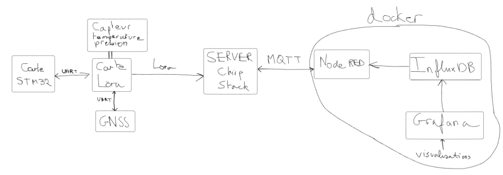
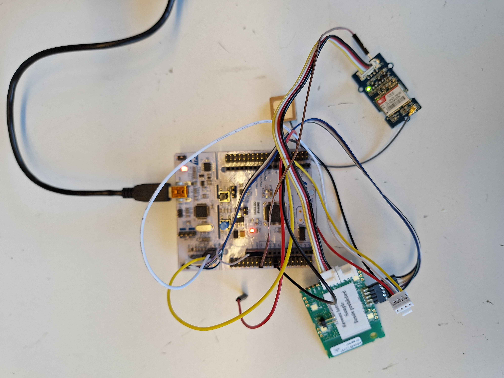

---

# Format de données

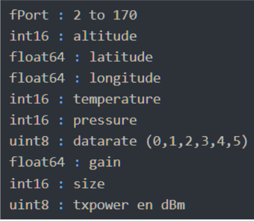

---

# Bilan énergétique

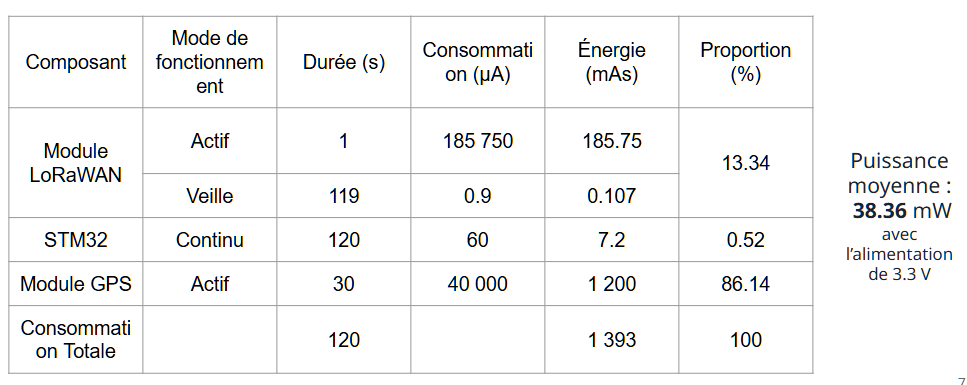

---

# Travail Réalisé

- Les données générées par les capteurs seront envoyées via le module LoRa de la carte vers le serveur Campus IoT (Chirpstack)

 

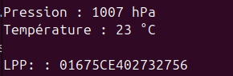

---

# Travail Réalisé - Chirpstack

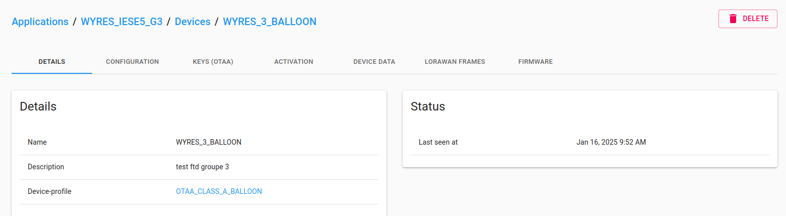

---

# Travail Réalisé - Chirpstack

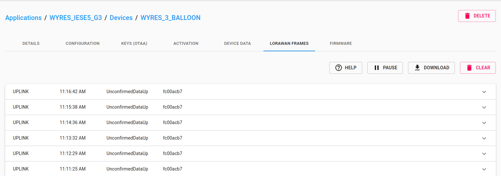

---

# Travail Réalisé - Chirpstack

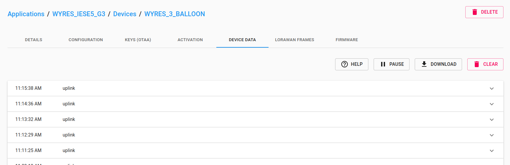

---

# Travail Réalisé - Chirpstack

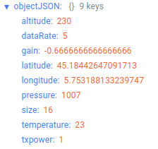

---

# Travail Réalisé

- NodeRed pour récupérer les données via IOT Campus et les décodées
- InfluxDB pour stocker les données

---

# Travail Réalisé - NodeRed

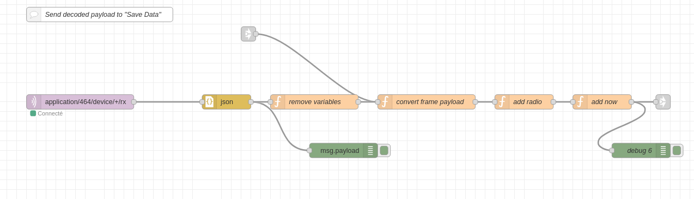
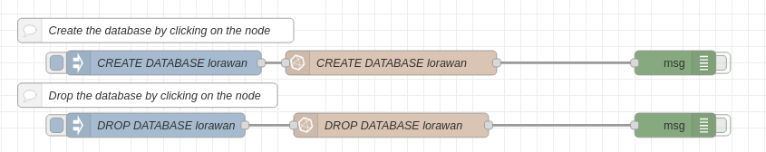

---

# Travail Réalisé - NodeRed

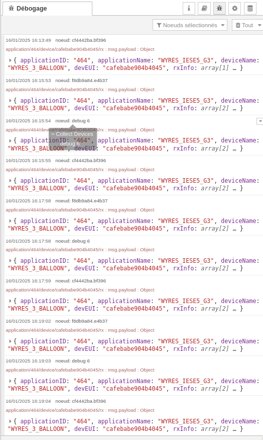

---

# Travail Réalisé - InfluxDB

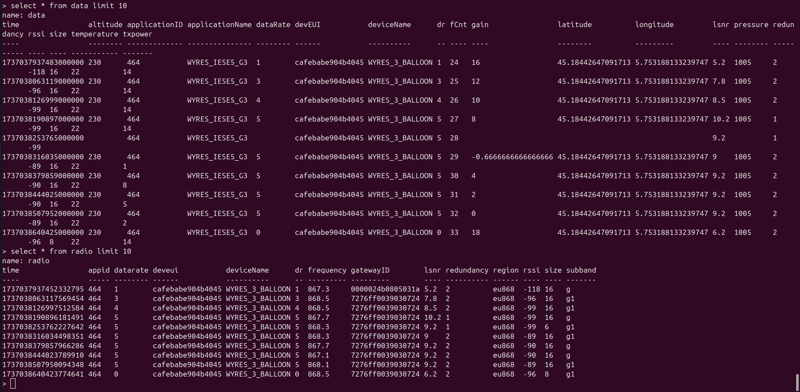

---

# Travail Réalisé - Visualisation de Grafana

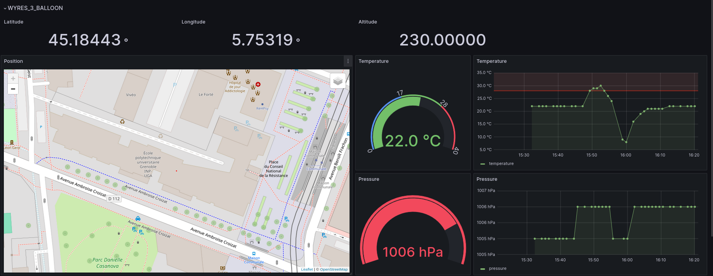
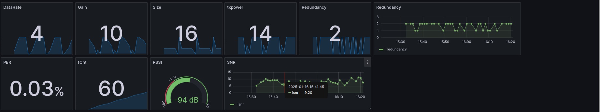

---

# Conclusion

- 60 lignes de code ajouté 
- Technologies IoT de bout en bout avec le serveur LoRaWAN open-source ChirpStack
- Les conteneurs docker pour le backend avec NodeRED, InfluxDB et Grafana
- Applicaiton FTD

 
  

---

class: center, middle

# Merci pour votre attention !  

.center[

]
