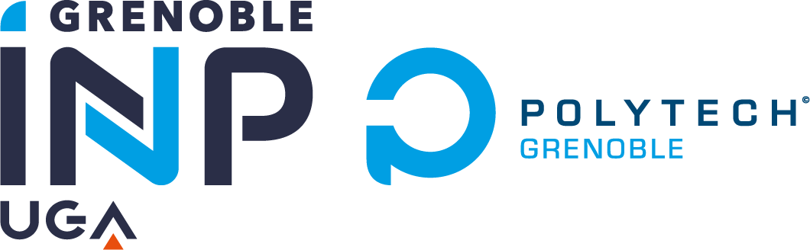

class: center, middle

# Introduction
test image
 
 
.center[

]

---

## What is RIOT?

- An **operating system** for microcontroller-based IoT devices

 - **microkernel architecture** &#x21d2; require very low resources
 - **real-time** and **multi-threaded**
 - comes with **in-house networking stacks**

 

- An **open-source platform & ecosystem**: <a href="https://github.com/RIOT-OS/RIOT">https://github.com/RIOT-OS/RIOT</a>

 - free software platform
 - **easy to use** and __reuse__
 - Standard programming in C, standard tooling
 - **API is independent** from the hardware

 

- A **world-wide community** of developers

 - lively exchanges on <a href="https://forum.riot-os.org/">Forum</a>, <a href="https://github.com/RIOT-OS/RIOT">GitHub</a> etc.
 - contributions from hundreds of developers from industry, academia, and makers
  

---

## RIOT in the IoT realm

.center[
  
&#x21d2; **RIOT is designed for low-end devices**
]

---

## History of RIOT

- 2013: Inria, FU Berlin and HAW co-founded RIOT

 - stemmed from a French-German research project
 - kernel evolved from FireKernel

--

- The community today:

  - So far, **~300** different contributors to the master branch
  - Academics: Berkeley, UCLA, MIT, AIT, TZI, etc
  - Industrial: Continental, Cisco, Samsung, ImgTec, Fujitsu, Thalès
  - SME: Zolertia, OTAKeys, Mesotic, Eistec, We-sens
  - Member of the EdgeXFoundry initiative

--

- Annual symposium: the RIOT Summit <a href="https://summit.riot-os.org">https://summit.riot-os.org</a>

.center[
&nbsp;

]

---

## Competitors

.center[
    
]

Reference: O. Hahm et al. "Operating Systems for Low-End Devices 
in the Internet of Things: A survey," IEEE Internet of ThingsJournal, 2016.

 
 

 - requires less memory & adapts to a wider range of architectures

 - fosters an open-source philosophy more akin to Linux

 - provides more integrated high-level functionalities

